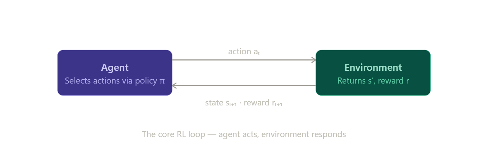

# The Reinforcement Learning Problem

## What is Reinforcemnet Learning?

- **Goal-directed learning** from interaction
- Learning what to do — how to map situations to actions — so as to **maximize a numerical reward** signal.
- focuses on training agents to **make sequences of decisions** by maximizing a notion of cumulative reward.

## Characteristics of RL

- Closed-loop system
- Do not have any direct instructions to what actions to take and where the consequences of actions, including reward signals
- Play out over extended time periods

## Core Framework of the RL Problem

**Objective:** Primary aim is to capture the essential aspects of a **learning agent** interacting with an **environment** to achieve a specific goal.

**Framework of RL:**

1. **Sensation:** The agent must be able to perceive or sense the state of its environment (to some degree).
2. **Action:** The agent must be able to take influential steps that actively affect or change that state.
3. **Goal:** The agent must have objectives that are directly related to the state of the environment.

This formulation is designed to be minimalist but robust. It includes sensation, action, and goals in their simplest forms without oversimplifying the inherent challenge of the problem.

| Elements | Role in Framework |
|----------|-------------------|
| Agent | The learner and decision-maker. |
| Environment | Everything outside the agent that it interacts with. |
| Interaction | The continuous cycle of sensing, acting, and progressing toward a goal. |

***NOTE:** The object of this kind of learning is for the system to extrapolate, or generalize, its responses so that it **acts correctly in situations not present in the training set.***

## RL vs. Other Machine Learning Paradigms

- RL is fundamentally different from *supervised learning*, which relies on a training set of labeled examples (correct actions) provided by an external supervisor.
- RL is also distinct from *unsupervised learning*, which focuses on finding hidden structures in collections of unlabeled data. RL, instead, is explicitly trying to maximize a reward signal.

## The Exploration-Exploitation Trade-off

**Exploitation (Maximizing Reward):** The agent chooses actions it already knows are effective based on past experience to secure immediate rewards.

**Exploration (Gaining Knowledge):** The agent tries new or sub-optimal actions to discover better strategies for the future.

**The Dilemma:** Neither can be used exclusively.

- Pure Exploitation leads to sub-optimal "greedy" behavior (missing out on potentially better paths).
- Pure Exploration fails to accumulate actual reward because the agent never applies what it has learned.

Quick Comparison:

| Features | Exploitation | Exploration |
|----------|--------------|-------------|
|Goal|Get the best known reward now.|Improve future decision-making.|
|Action Choice|Pick the "Best" current option.|Pick a "Random" or "New" option.|
|Risk|Missing a better hidden strategy.|Wasting time/reward on poor choices.|

## Elements of Reinforcement Learning

Beyond the agent and the environment, one can identify four main subelements of RL subsystem:

1. ***Policy*** : Defines the learning agent's way of behaving at a given time.
2. ***Reward Signal***: Defines the goal in a reinforcement learning problem.
3. ***Value Function***: While rewards indicate immediate desirability, a value function specifies what is good in the long run.
4. ***Model of the Environment (Optional)***: A model mimics the behavior of the environment and allows the agent to make inferences about how the environment will behave.

## Summary

Reinforcement learning is a computational approach to understanding and automating goal-directed learning and decision-making. It is distinguished from other computational approaches by its emphasis on learning by an agent from direct interaction with its environment, without relying on exemplary supervision or complete models of the environment.

Reinforcement learning uses a formal framework defining the interaction between a learning agent and its environment in terms of states, actions, and rewards. This framework is intended to be a simple way of representing essential features of the artificial intelligence problem. These features include a sense of cause and effect, a sense of uncertainty and nondeterminism, and the existence of explicit goals.

